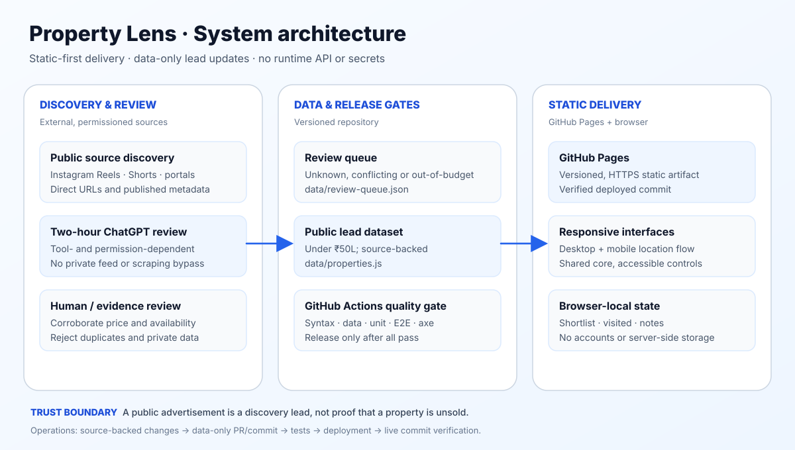
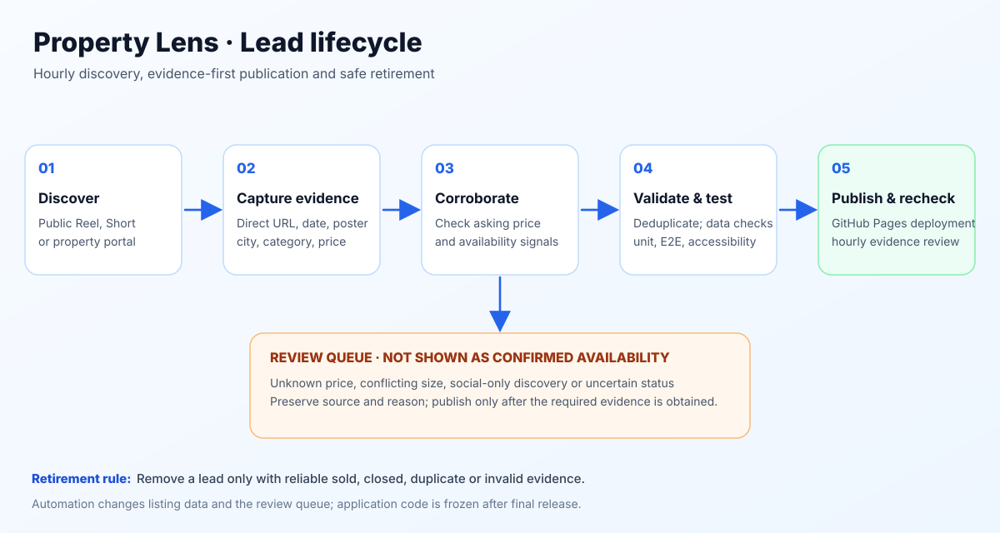

# Property Lens

[](https://github.com/varunjakkampudi-tech/property-lens/actions/workflows/pages.yml)
[](https://github.com/varunjakkampudi-tech/property-lens/actions/workflows/quality.yml)
[](https://github.com/varunjakkampudi-tech/property-lens/actions/workflows/production-health.yml)

A lightweight, source-backed property-research dashboard for **Vizag, Tanuku, Palakollu, Bhimavaram and Eluru, Andhra Pradesh**. Browse flats, independent houses and residential plots with publicly advertised asking prices **strictly below ₹50 lakh**.

**[Open Property Lens](https://varunjakkampudi-tech.github.io/property-lens/)** · [Architecture](docs/ARCHITECTURE.md) · [Lead operations](docs/LEAD-OPERATIONS.md) · [Deployment](docs/DEPLOYMENT.md)

> **Availability disclaimer:** A property appearing on a public portal or social post does not establish that it remains unsold. Property Lens displays research leads, not seller-guaranteed inventory. Confirm price, availability, identity and legal documents before visiting or paying an advance.

## Product

- Five locations × three categories; **Location → Property type → Listings** on both desktop and mobile.
- A streamlined desktop chooser with search, budget and sorting up front; optional advanced age, community and research filters.
- Search, sorting, browser-local saved leads, visited tracking, notes and comparison (up to four).
- Direct listing links where available; results-page links are explicitly labeled.
- Poster/source provenance, source-check dates, maps and deliberately public business inquiry details.
- **Indicative market-value comparison** on cards/details/compare, derived only when at least three recent, similarly sized, like-for-like direct listings support it. Flats can use a clearly identified city-wide fallback with at least five comparables; houses without reliable land/building evidence display **Not available**. The card shows the comparable scope and source-check date. Asking-price comparisons are not appraisals or verified sale values.
- Budget presets from ₹20L to ₹45L and an all-under-₹50L view.
- A custom scalable roof-and-lens logo, Manrope typography, same-origin SVG icons, responsive layouts, keyboard support, visible focus and automated axe accessibility checks.

## System architecture



The production site is **static HTML, CSS and JavaScript** on GitHub Pages. There is no runtime API, database, user account, server-side storage, privileged client key or client-side tracking. Shared browser primitives live in `assets/core.js`; desktop and mobile interfaces consume the same versioned listing data. Comparable market estimates are derived at render time from that dataset, so no separate opaque valuation feed is implied.



Unknown-price, conflicting, out-of-budget and uncorroborated social discoveries remain in `data/review-queue.json`. The main dataset `data/properties.js` contains source-backed under-₹50L research leads with an explicit availability state. The selected UI budget never restricts discovery.

## Get started

**Requirements:** Node.js 22+; Python is not required.

```bash
npm ci
npm run dev
```

Open **http://127.0.0.1:4173/**. The local server exposes only the public site files and does not publish repository internals.

```bash
npm run test:syntax    # JavaScript syntax
npm run test:data      # Listing, source and review-queue integrity
npm run test:unit      # Shared core, trust-contract, production-health and server tests
npx playwright install chromium
npm run test:e2e       # Starts its own local server if needed
npm run test:quality   # All gates
```

Playwright covers 375px, 390px and 430px mobile viewports plus desktop, navigation, data-driven counts, search focus, filters, saved/compare state, dialogs and serious/critical axe violations. See [quality and release gates](docs/ARCHITECTURE.md#quality-and-release-gates).

## Repository layout

```text
assets/
  core.js               Shared escaping, eligibility, storage, source and icon helpers
  app.js                Desktop interface and browser-local research tools
  mobile-location.js    Mobile location → category → listings interface
  enrichment.js         Source provenance, contact and desktop detail panels
  styles.css            Established layout and accessibility foundations
  design-refresh.css    Shared brand typography and simplified desktop layout
  icons.svg             Same-origin professional icon symbols
  favicon.svg           Scalable Property Lens roof-and-lens mark
data/
  properties.js         Public research leads and market metadata
  review-queue.json     Excluded and evidence-pending discoveries
docs/
  diagrams/             Editable SVG architecture and lifecycle images
  ARCHITECTURE.md       Boundaries, Mermaid diagrams and release contract
  DATA-DICTIONARY.md    Listing schema and status semantics
  LEAD-OPERATIONS.md    Two-hour discovery and data-only release runbook
scripts/
  serve.cjs             Allowlisted local development server
  validate-data.cjs     Release-blocking integrity validation
  production-health.cjs Exact-live-commit and per-city freshness checks
  market-coverage.cjs  Transparent comparable-coverage report
tests/
  core.test.cjs         Shared primitive unit tests
  data-contract.test.cjs Negative data-trust and schema regression tests
  production-health.test.cjs Live verification and freshness regression tests
  server.test.cjs       Local-server security and routing tests
  e2e.spec.js           Responsive, behavioral and accessibility tests
.github/workflows/
  quality.yml           Pull-request checks
  pages.yml             Tested GitHub Pages deployment and live verification
  production-health.yml Independent daily live-site and source-freshness checks
  scheduled-discovery.yml Hourly approved-feed discovery and data-only PR publisher
```

## Two-hour discovery and code freeze

The active **ChatGPT task runs every two hours**. It prioritizes publicly accessible Instagram Reels, YouTube Shorts, local agents/builders and permitted property portals for all five cities and three categories. Discovery and repository writes depend on the task's available tools and permissions; the static website does **not** scrape Instagram or autonomously run background jobs. Private/personalized feeds are not accessible through ordinary public search.

**Scheduled changes are data-only:** `data/properties.js` and `data/review-queue.json`. No scheduled UI, architecture, dependency or documentation rewrites. A substantive code/security regression requires a separately reviewed change. Every data commit must pass syntax, integrity, unit, mobile/desktop E2E, accessibility, deployment and exact-commit live smoke checks. A pending or failed run is not a published update.

Submit a public Reel, Short, listing URL or sold-listing report through the [lead-review issue form](https://github.com/varunjakkampudi-tech/property-lens/issues/new?template=property-lead.yml) (GitHub sign-in required). Do not submit private phone numbers or unverified claims.

## Production acceptance and operational boundaries

- Every published application or data commit must pass source syntax, data integrity, unit tests, responsive browser journeys, accessibility, Pages deployment and exact-SHA live verification.
- The independent daily GitHub Actions health workflow checks the live SHA and six public assets, then reports source-check freshness by city. It fails when a city with published leads has no source check within 14 days. A source check is **not** seller-confirmed availability.
- Public asking-price comparisons are deliberately limited by comparable evidence. The UI must show **Not available** when a reliable estimate cannot be derived; it must never manufacture a value.
- Unattended lead publication uses the active ChatGPT task with explicit repository write authorization. It creates data-only PRs, enables squash auto-merge, and relies on the required `quality` check before Pages deployment. If a scheduled run is blocked by tool permissions, it must preserve discovered evidence and report the blocker, not claim deployment.
- GitHub repository branch protections, required PR checks and task notifications are account settings. Confirm these in GitHub and ChatGPT Tasks; the repository cannot silently enable them.

## Repository-native scheduler

The active publishing path is the two-hour ChatGPT task described above. `.github/workflows/scheduled-discovery.yml` is a separate, inactive Option B integration boundary: it runs hourly or manually only when an owner-approved HTTPS JSON feed is configured. It uses a non-overlapping concurrency group, bounded retries and response limits, full validation/deduplication, and 90-day execution artifacts. Without a feed, it is an explicit successful no-op and must not be described as an operational source.

If Option B is activated later, the feed must be an owner-approved JSON endpoint returning either an array or `{ "records": [] }` of records matching the complete published data contract. Configure `PROPERTY_DISCOVERY_FEED_URL`, optional `PROPERTY_DISCOVERY_FEED_TOKEN`, and `PROPERTY_PUBLISHER_TOKEN` as GitHub Actions secrets. `PROPERTY_PUBLISHER_TOKEN` must be narrowly scoped, and credentials must never appear in source or logs. Do not configure a competing publisher without documenting which path is authoritative.

## Further documentation

[Architecture](docs/ARCHITECTURE.md) · [Brand guide](docs/BRAND-GUIDE.md) · [Deployment](docs/DEPLOYMENT.md) · [Data dictionary](docs/DATA-DICTIONARY.md) · [Lead operations](docs/LEAD-OPERATIONS.md) · [Buyer checklist](docs/BUYING-CHECKLIST.md) · [Research notes](docs/RESEARCH-NOTES.md) · [UI reference](docs/UI-REFERENCE.md)
