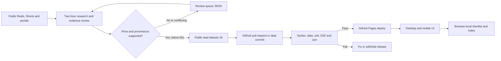
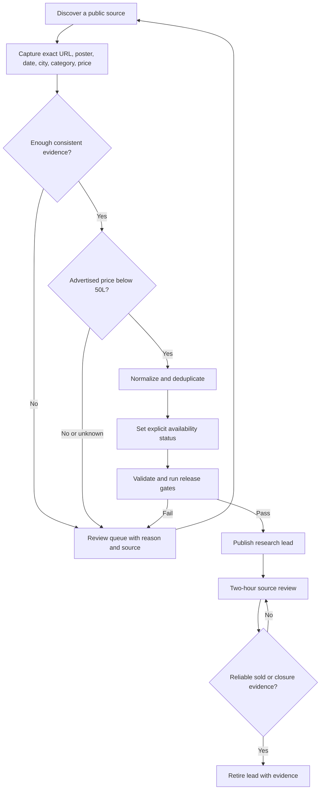

# Property Lens architecture and engineering contract

**Status:** Static-first production architecture · **Scope:** five cities, three property categories · **Runtime:** GitHub Pages

## 1. Architectural decision

The current product is a public, read-mostly research dashboard. Static hosting is the right-sized architecture: no user authentication, server-side persistence, secret management or runtime API is necessary. A framework or backend would add operational cost without improving the existing user journeys.

The source of truth is versioned repository data. The browser reads `window.PROPERTY_DATA`, `window.MARKET_DATA` and `window.SOURCE_CONTACTS` and never writes those datasets. Saved items, visited flags and personal notes remain in browser `localStorage`; no cross-device sync is implied.

## 2. Module boundaries

| Module | Responsibility | Explicit non-responsibility |
|---|---|---|
| `data/properties.js` | Versioned public leads, market metadata and published business contacts | Seller verification, user state, credentials |
| `data/review-queue.json` | Excluded or evidence-pending discoveries and reasons | Published inventory |
| `assets/core.js` | HTML escaping, price formatting, eligibility, safe local storage, source-link semantics and allowlisted icon markup | DOM rendering and network access |
| `assets/app.js` | Desktop navigation, filtering, shortlist, visited state, notes and comparison | Data discovery or source ingestion |
| `assets/mobile-location.js` | Mobile location → category → listings flow, search, filters, details and comparison | Desktop layout |
| `assets/enrichment.js` | Desktop source metadata, contact directory and detail enrichment | Property identity matching by display name |
| `assets/styles.css` | Established desktop/mobile layout, focus, touch targets and reduced motion | Application state |
| `assets/design-refresh.css` | Shared Manrope typography, brand tokens and mobile-inspired desktop composition | Business logic |
| `assets/icons.svg`, `assets/favicon.svg` | Same-origin SVG icon library and roof-and-lens brand mark | Remote icon fonts |
| `scripts/validate-data.cjs` | Release-blocking schema, identity, price, URL, provenance and queue checks | Proving a seller still has inventory |
| `scripts/serve.cjs` | Local, allowlisted development/test HTTP server | Production hosting |
| `tests/*` | Unit, security, responsive, behavioral and accessibility regression checks | Real-time seller availability checks |
| `scripts/production-health.cjs` | Read-only exact-SHA live asset verification and 14-day per-city source-check freshness | Discovery, seller confirmation or GitHub mutation |
| `scripts/discovery.cjs` | Approved HTTPS feed retrieval, bounded retries, normalization checks and duplicate quarantine | Portal scraping, private feeds or invented records |
| `scripts/publish-data.cjs` | Converts a validated discovery run into a reviewable data-only proposal | Auto-merge, deployment or seller confirmation |
| `.github/workflows/production-health.yml` | Independent daily production health signal | Data publication or permission escalation |
| `.github/workflows/scheduled-discovery.yml` | Manual approved-feed discovery, persistent run artifact and data-only PR | Private-feed access, bypassing terms or auto-merging |

Keep modules dependency-free at runtime. Load the dataset, then `core.js`, then desktop/enrichment/mobile modules. The mobile UI is the sole mobile implementation; obsolete mobile navigation and legacy city-mode CSS must not be reintroduced. Desktop follows the same location → category → listings decision flow, with optional advanced filters and secondary resources.

## 3. Lead lifecycle and data contract

**Main research results are not guaranteed-available inventory.** Every displayed lead has a supported advertised price strictly below ₹50 lakh, source provenance and `availabilityStatus`. The current dataset uses `publicly_listed_unconfirmed`; seller-confirmed status requires dated evidence. Never infer availability from a Reel remaining online, a portal index result or a source-check date.

A `Direct listing` URL opens an individual advertisement. Other `linkType` values identify search or results pages; the UI must label them as **source results**, not pretend they are exact listing links. Unconfirmed social-only discoveries, conflicting prices/areas and private contact details are not promoted into the main dataset.

The selected budget is a **view filter**. Discovery covers the full under-₹50L target even if a visitor chooses a lower preset. A city/category may legitimately have zero eligible leads; the interface shows a truthful count and disables empty choices.

## 4. Security, privacy and accessibility

- Escape all listing and contact text before constructing HTML. Validate external source, map and business URLs as public HTTPS; do not embed secrets or ingest arbitrary script.
- Use stable property IDs across filtering, dialogs, shortlist and deduplication. Never identify a lead solely by its title.
- Store personal notes and saved/visited state only in the browser. Parse malformed storage defensively; never expose it to the static dataset or third-party links.
- Collect only business/agent contact information intentionally published for inquiries. Do not extract private phone numbers from video frames, gated contact screens or personal feeds.
- Provide semantic landmarks, named dialogs, keyboard-operable buttons, `aria-pressed` for toggles, visible focus, usable touch targets and a skip link targeting the visible main landmark.
- Keep search focus and caret stable while updating cards; retain the open filter panel when budget changes and preserve the compare screen when removing a comparison item.
- Honor `prefers-reduced-motion`; test mobile at 375/390/430px, desktop and live breakpoint transitions. Avoid horizontal page overflow.

## 5. Quality and release gates

| Gate | Command / verification | Blocks release when |
|---|---|---|
| Syntax | `npm run test:syntax` | Any checked JS file fails parsing |
| Data and trust | `npm run test:data` | Invalid identity, price, category, status, date, URL, contact or review queue |
| Unit and security | `npm run test:unit` | Shared primitives or local-server tests fail |
| Dependency security | `npm audit --audit-level=high` | A high/critical npm advisory affects the locked dependency tree |
| Browser journeys | `npm run test:e2e` | Mobile/desktop flow, filters, focus, shortlist, compare or dialogs regress |
| Accessibility | Playwright + axe | Serious or critical violations |
| Deployment | `.github/workflows/pages.yml` | Build, Pages deployment or live smoke verification fails |
| Publication identity | `deploy-version.txt` | Published SHA differs from the commit being released |
| Daily operational health | `scripts/production-health.cjs` in scheduled workflow | Live SHA/assets fail or an active city lacks a source check within 14 days |

Playwright derives counts from the current dataset rather than hard-coded inventory. The local server starts automatically during E2E; CI uses a fresh server. GitHub Actions deploys only from `main`, creates a clean `_site` artifact and verifies the live homepage, data, mobile script, shared core and exact commit marker. A queued, in-progress, cancelled or failed workflow is not a successful release.

## 6. Post-release code freeze

The active two-hour task may change **only** `data/properties.js` and `data/review-queue.json`. Every data change still runs the complete release pipeline. Do not automatically rewrite the UI, architecture, dependencies, workflows or documentation. Critical defects and security fixes require a separate, reviewed engineering change.

The two-hour ChatGPT task is distinct from GitHub Actions. It is the active web-research publisher, while the feed workflow is an inactive alternative until an approved feed exists. Its execution and repository writes depend on the tools and permissions available at run time. It cannot see private or personalized Instagram feeds and must never claim exhaustive coverage. See [Lead operations](LEAD-OPERATIONS.md) for evidence and failure handling.
